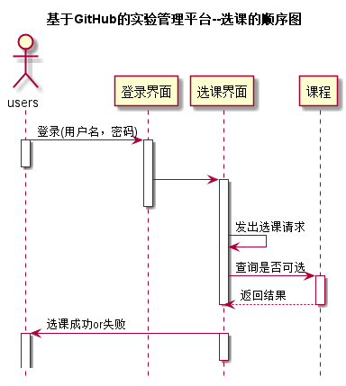

<!-- markdownlint-disable MD033-->
<!-- 禁止MD033类型的警告 https://www.npmjs.com/package/markdownlint -->

# “选课”用例 [返回](../README.md)
## 1. 用例规约

|用例名称|查看成绩|
|-------|:-------------|
|功能|学生查看自己的每个实验的实验成绩及实验评价|
|参与者|学生|
|前置条件|学生需要先登录|
|后置条件| |
|主事件流| 1.进入选课页面  2.选择课程   3.提交课程id及名称  4.返回选课结果|
|备选事件流| |

## 2. 业务流程（顺序图） [源码](../src/选课.puml)
 

## 3. 界面设计
- 界面参照: https://n1324648297.github.io/is_analysis/test6/ui/选课.html
- API接口调用
    - 接口1：[setCourse](../接口/setCourse.md) 

## 4. 算法描述
    无
    
## 5. 参照表
- [TERMS](../数据库设计.md/#TERMS)
- [COURSES](../数据库设计.md/#COURSES)

